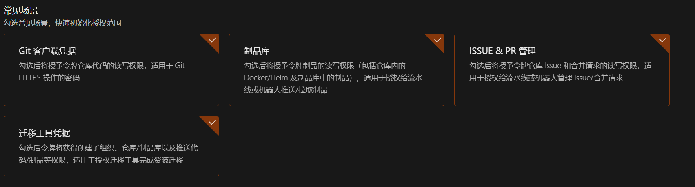
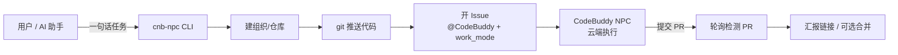

# cnb-npc-skill

让 CNB 的 CodeBuddy NPC 替自己上班：一句话派发任务，云端 AI 在仓库里自主完成开发并提交 PR，你只负责验收。

[](LICENSE)
[](package.json)
[](.github/workflows/ci.yml)
[](https://github.com/Zi-Yi-Ming/cnb-npc-skill/stargazers)
[](https://github.com/Zi-Yi-Ming/cnb-npc-skill/issues)

## 简介

[CNB](https://cnb.cool) 平台的 CodeBuddy NPC 是一个运行在云端的 AI 智能体：你在仓库的 Issue 里 `@CodeBuddy` 并开启工作模式，它就能自己完成需求理解、读代码、建分支、写代码、提 PR 的整个流程。

问题在于手动操作太繁琐：注册 → 建仓库 → 推送代码 → 开 Issue → 等结果 → 反复刷新页面。cnb-npc-skill 把这些封装成一条命令：

```bash
node bin/cnb-npc.js run "写一个 Python 脚本 hello.py，输出 Hello, CodeBuddy NPC!"
```

之后的建组织/建仓库、推送代码、开 Issue（`@CodeBuddy` + 工作模式）、轮询 NPC 进度、汇报 PR 链接（可选自动合并）全部自动完成。

## 为什么用它

把 CodeBuddy NPC 当成一个"干杂活的子智能体"：主力 agent（Claude Code、AtomCode 这类）保留给需要复杂推理的任务，而**已经规划好、按部就班的任务，以及简单但繁琐的任务**，交给 NPC 在云端异步执行。类似 Claude Code 里把简单任务交给 Haiku 的定位——各司其职。

具体收益：

- **不占主力 agent 的上下文**：任务在 CNB 云端独立执行，不挤占本地对话窗口
- **不占模型并发输出**：NPC 走 CNB 平台自己的模型资源，和你的本地 API 额度互不影响
- **免费**：当前 CodeBuddy NPC 免费使用（官方原话"临时免费，年后再说"，仅 CodeBuddy，内置 hy3、deepseek-v4-flash 等模型）
- **质量可靠**：提示词给得相对完整时输出质量很高，大项目和批量数据处理都适用

### 它到底是什么

准确地说，CodeBuddy NPC 不是"CodeBuddy 接了一些 MCP"：它是在 Issue/PR 评论里 `@` 触发（`issue.comment@npc` 事件）→ 平台拉起 NPC 运行时 → 基于 CodeBuddy SDK 的 Agent 自主获取仓库上下文、调用 CNB Skills（OpenAPI / CNB CLI 封装）操作仓库、Issue、PR → 在工作模式授权下写代码、建分支、提 PR → 在 Issue 里等你验收。和编辑器里实时给建议的 Copilot 不同，它是**异步接单、自主执行、提交 PR 等验收**的云端智能体，更像挂在远程仓库上的一个 AI 同事。

它的角色、提示词与行为都是开源的：[npc/CodeBuddy](https://cnb.cool/npc/CodeBuddy)（CodeBuddy NPC 官方仓库，支持 fork 自定义角色、SOP 与 Skills）。本工具则是把"创建仓库、推送代码、开 Issue 触发 NPC、轮询验收"这套流程封装成一条命令。

## 特性

- **首次引导**：自动检测 Token，打开浏览器完成注册/生成令牌，粘贴即校验并持久化，全程只需人工做"注册 + 粘贴令牌"两件事
- **自动建组织/仓库**：通过 `group-manage` / `group-resource` API，没有组织也能直接开跑
- **工作模式 API 直开**：创建 Issue 时传 `work_mode: true`，不需要到网页勾选"替我上班"
- **轮询与合并**：监听 NPC 提交的 PR（`author.is_npc`），支持超时控制，可自动 squash 合并
- **零依赖**：只需要 Node.js ≥ 18（内置 fetch）和 git，没有第三方包
- **可被 AI 助手调用**：内置 `SKILL.md`，安装到 Claude Code / Opencode 等助手的 skills 目录后，说一句"让 NPC 替我上班"即可触发
- **令牌安全**：Token 只存环境变量或 `~/.cnb-npc/config.json`，不会写进 Issue 正文，git remote 推送后自动清理令牌

## 快速开始

### 前置要求

| 依赖 | 版本 |
|---|---|
| [Node.js](https://nodejs.org) | ≥ 18（内置 `fetch`） |
| [git](https://git-scm.com) | 任意现代版本 |
| [CNB 账号](https://cnb.cool) | 免费注册 |

### 1. 安装

```bash
git clone https://github.com/Zi-Yi-Ming/cnb-npc-skill.git
cd cnb-npc-skill
# 零依赖，无需 npm install
```

### 2. 首次引导（仅一次）

```bash
node bin/cnb-npc.js onboard
```

脚本会检测已有 Token，没有则打开浏览器跳转注册页与令牌页，提示勾选授权范围，粘贴令牌后校验并保存到 `~/.cnb-npc/config.json`。

建议勾选的授权范围：

| 权限 | 范围 | 用途 |
|---|---|---|
| `group-resource` | 读写 | 自动建仓库 |
| `repo-issue` | 读写 | 开 Issue + `work_mode` 工作模式 |
| `repo-pr` | 读写 | 轮询 PR + 自动合并 |
| `repo-code` | 读写 | git 推送 + 查默认分支 |
| `repo-basic-info` | 只读 | 仓库存在性判断 |
| `repo-notes` | 只读 | 读取 NPC 评论 |
| `account-engage` | 只读 | 列出组织（免去手输 `--org`） |

> 省事做法：常见场景直接全选。令牌仅保存在本机，风险可控。



### 3. 派发任务

```bash
# 从零实现（自动建组织/仓库，默认私有）
node bin/cnb-npc.js run "写一个 Rust CLI 工具，读取 CSV 输出 Markdown 表格"

# 在现有代码仓库上干活
node bin/cnb-npc.js run "给 README 补一份 API 使用示例" --dir ./my-code --org my-org --repo my-repo

# 自动合并 NPC 的 PR
node bin/cnb-npc.js run "修复登录页的 XSS 漏洞" --org my-org --repo web-app --merge
```

### 4. 查看状态

```bash
node bin/cnb-npc.js status
```

## 命令参考

### 子命令

| 命令 | 说明 |
|---|---|
| `onboard` | 首次引导：注册/生成/校验/持久化访问令牌 |
| `run "<任务>"` | 端到端派发任务给 CodeBuddy NPC |
| `status` | 查看令牌来源与可访问组织 |
| `--help` | 帮助信息 |

### `run` 选项

| 选项 | 说明 | 默认值 |
|---|---|---|
| `--org <slug>` | 组织路径 | 已有第一个组织 / `npc-workspace` |
| `--repo <name>` | 仓库名 | `npc-task` |
| `--dir <路径>` | 本地代码目录 | 临时 README 空仓库 |
| `--visibility <v>` | 仓库可见性 `public`/`private`/`secret` | `private` |
| `--timeout <秒>` | 轮询超时 | `3600` |
| `--interval <秒>` | 轮询间隔 | `30` |
| `--merge` | 检测到 PR 后自动 squash 合并 | 关 |
| `--no-browser` | onboard 时不自动打开浏览器 | 开 |

### 环境变量

| 变量 | 说明 |
|---|---|
| `CNB_TOKEN` | CNB 访问令牌（优先于本地配置文件） |

## 架构



cnb-npc 通过 [CNB OpenAPI](https://api.cnb.cool) 与平台交互，各步骤对应的接口与所需权限：

| 步骤 | OpenAPI 接口 | 所需权限 |
|---|---|---|
| 列组织 | `GET /user/groups` | `account-engage:r` |
| 建组织 | `POST /groups` | `group-manage:rw` |
| 建仓库 | `POST /{slug}/-/repos` | `group-resource:rw` |
| 查仓库/默认分支 | `GET /{repo}`、`GET /{repo}/-/git/head` | `repo-basic-info:r`、`repo-code:r` |
| 开 Issue（含工作模式） | `POST /{repo}/-/issues`（`work_mode: true`） | `repo-issue:rw` |
| 读评论 | `GET /{repo}/-/issues/{n}/comments` | `repo-notes:r` |
| 查 PR | `GET /{repo}/-/pulls` | `repo-pr:r` |
| 合并 PR | `PUT /{repo}/-/pulls/{n}/merge` | `repo-pr:rw` |

### 目录结构

```
cnb-npc-skill/
├── bin/
│   └── cnb-npc.js        # CLI 入口：onboard / run / status
├── lib/
│   ├── api.js            # CNB OpenAPI 客户端（零依赖，内置 fetch）
│   └── config.js         # Token 存取（环境变量优先 → ~/.cnb-npc/config.json）
├── SKILL.md              # 技能定义（可安装到 AI 助手的 skills 目录）
├── package.json          # bin 入口 + npm scripts
├── LICENSE               # MIT
└── README.md
```

## 注意事项

- `@CodeBuddy` 必须写在 Issue 正文的纯文本位置（代码块/引用/列表/表格里的 @ 不会触发 NPC）
- 编辑或重开 Issue 不会重新触发 NPC；需要再次派活请在 Issue 下发新评论 `@CodeBuddy`
- 评论数超过 100 条后不再触发任何 `@npc` 事件
- NPC 在 Issue 所属仓库的默认分支上执行，脚本会自动查询并推送到默认分支
- NPC 执行是分钟~小时级，属于异步任务，建议 `--timeout` 留足余量

## 安全

- 令牌只存环境变量或 `~/.cnb-npc/config.json`，不会写进 Issue 正文（仓库可能公开）
- git 推送使用一次性带令牌 URL，推送后 remote 换回干净地址，避免令牌残留在 `.git/config`
- 仓库默认 `private`；需要公开时用 `--visibility public`
- NPC 侧的 `CNB_TOKEN` 由平台限制在单仓库内

## 计费

当前 CNB 的 NPC 为免费阶段。官方原话：临时免费，年后再说（免费仅限CodeBuddy，内置hy3和deepseek-v4-flash）。收费政策以官方公告为准。用量可在 `组织 → 设置 → 用量管理` 查看（详见 [CNB 定价文档](https://docs.cnb.cool/zh/pricing.html)）。

## FAQ

**没注册过 CNB 能用吗？**

能。`onboard` 会自动跳转注册页，全程只需人工做两件事：注册账号、粘贴令牌，之后全自动。

**一定要有自己的组织吗？**

不需要。脚本默认自动创建 `npc-workspace`；你已有组织时建议用 `--org` 指定（根组织有年度创建上限）。

**NPC 没反应怎么办？**

检查 Issue 正文 `@CodeBuddy` 是否为纯文本、`work_mode` 是否开启；再到 Issue 页面看是否有 NPC 评论/流水线状态。轮询超时后脚本会给出 Issue 链接，可到页面催办。

**为什么不用 GitHub Actions？**

本工具面向 CNB 平台生态（NPC 只在 CNB 仓库内执行）。它可以在本地、CI、或任意 AI 助手环境中运行。

## 贡献

欢迎提交 Issue 与 PR：

1. Fork 本仓库
2. 创建特性分支：`git checkout -b feat/xxx`
3. 提交改动：`git commit -m "feat: xxx"`
4. 推送分支：`git push origin feat/xxx`
5. 提交 Pull Request

开发前请运行语法检查：`npm run check`

## License

[MIT](LICENSE) © cnb-npc contributors
